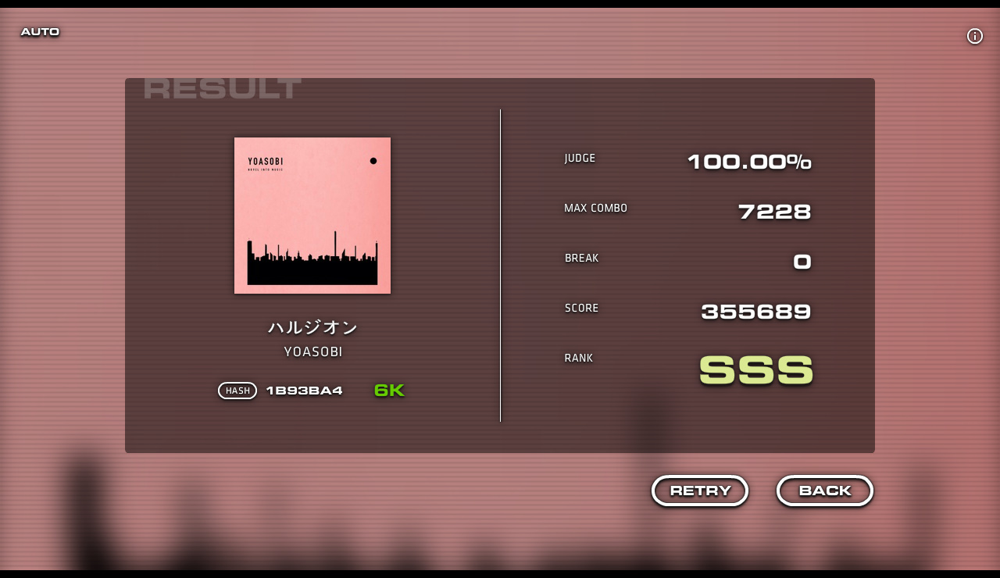

# Take 0

**[▶ Gameplay video](https://youtu.be/cUBBpqlfMAc)**

A keyboard rhythm game built as an homage to [DJMAX](https://en.wikipedia.org/wiki/DJMax).

## Screenshots

## Usage

- `play.exe`: the game itself
- `make.exe`: note data editor
- `config.exe`: key bindings, scroll speed, and offset settings
- Scroll speed: 1–5 in steps of 0.5, `↑`/`↓` to adjust
- Pause during play: `Esc`

## Scoring

- Score:
  - Base max of 300,000 points, plus bonus points from fever multipliers. (An all-Awesome full combo with no fever active scores exactly 300,000.)
  - Per-note points are Awesome : Cool : Good : Bad = 5 : 3 : 2 : 1.
  - Long notes are only scored at their head and tail; combo count has no effect on score.
  - Fever score multipliers: `×2` → 1.05x, `×3` → 1.1x, `×4` → 1.15x, `×5` → 1.2x.
- Judgment windows: `Awesome` ±0.05s, `Cool` ±0.1s, `Good` ±0.15s, `Bad` ±0.25s, `Break` (a miss), `Fault` (an indirect miss).
- HP:
  - Max gauge of 200; each note restores `Awesome` 5, `Cool` 3, `Good` 2, `Bad` 1.
  - The held middle of a long note restores 1 every 0.1s.
  - A `Break` costs 10, a `Fault` costs 5.
- Fever:
  - Has `×2` through `×5` tiers; every tier lasts 10 seconds once activated. (Activating at the `×5` tier triggers a `×5` fever.)
  - Max gauge of 200; only `Awesome` and `Cool` judgments restore 5 each, and the held middle of a long note restores 2 every 0.1s.
  - Once full, press the fever key to activate it.
  - A `Break` judgment ends an active fever. (It doesn't affect the gauge itself.)
- Combo:
  - Increases in proportion to the active fever tier.
  - The held middle of a long note adds to the combo every 0.1s.
- Accuracy (%): (100 × `Awesome` + 80 × `Cool` + 60 × `Good` + 30 × `Bad`) / (`Awesome` + `Cool` + `Good` + `Bad`)
- Rank:
  - Based on accuracy.
  - `F` on a fail, otherwise `SSS` at 99%+, `SS` at 98%+, `S` at 97%+, `AA` at 94%+, `A` at 90%+, `B` at 70%+, `C` at 30%+, `D` below 30%.

## Notes

- Playing requires a song (`.mp3`), album art (`.jpg`/`.png`), and note data (`.note`).
- Offset can be adjusted within ±250ms.
- Optimization is rough, so stuttering can happen — a higher-spec machine is recommended.
- The program may crash on load if the file size is too large.
- Note data can be created by pressing keys live in the note editor.

## Creating Note Data

- For correct tags and sync, songs downloaded from [Melon](https://melon.com) (for Korean users) are recommended.
- For album art, the 200×200 image from a [Bugs](https://music.bugs.co.kr/) (for Korean users) search result works well.
- A BPM finder useful for creating note data: <https://vocalremover.org/key-bpm-finder>
- Notes can be charted by pressing the keys live, in time with the song.
- Option reference:
  - `KEY MODE`: 4 to 8 keys
  - `BPM`: the song's BPM, needed since notes are generated relative to it.
  - `MAXIMUM NOTES PER A BEAT` (leaving this at default is recommended):
    - Sets how many subdivisions count as the smallest unit within one beat.
    - For example, at 4 with a BPM of 100, one beat is 0.6s, so the shortest note interval becomes 0.15s.
  - `MINIMUM LENGTH OF LONG NOTES` (leaving this at default is recommended):
    - A generated long note's hold duration must exceed this value — anything shorter is created as a regular note instead.

## About

- **Timeline:** 2015-06-05 – 2015-06-11; 2018-12-18; 2022-07-08 – 2022-07-30
- **Latest version:** `v1.1.0` (July 30, 2022)
- **Environment:** Adobe Flash CS6, ActionScript 3
- **Platform:** Windows

## Changelog

- `v1.1.0` (July 30, 2022):
  - Added an offset setting.
  - Fixed a bug where fever time kept counting down while paused.
- `v1.0.0` (July 28, 2022):
  - Loosened the judgment thresholds and added a pause menu.
  - Other bug fixes and edge-case handling.
- `Beta` (July 26, 2022):
  - Added the HP and fever system.
  - Added a hash value to verify note data integrity.
  - Changed the judgment and scoring systems, and added a results screen.
  - Added an options menu and a separate settings program.
  - Expanded from 6-key only to 4–8 key modes.
  - Made note timing BPM-based — the note interval, previously fixed regardless of the song, is now computed per song from an entered BPM.
  - Ported from ActionScript 2.0 to 3.0.
- 2018-12-18:
  - Added loading note data from a file, and the note editor (`make.exe`) used to create it — until then, the game only played back hardcoded note data.
  - Added a rough scoring system, put together in a single day.
  - The note interval was still fixed, independent of the song's BPM.
- 2015-06-05 – 2015-06-11:
  - First version — hardcoded note data, a fixed note interval, judgment, and combo counting.

---
[github.com/canplane/Take-0](https://github.com/canplane/Take-0)
